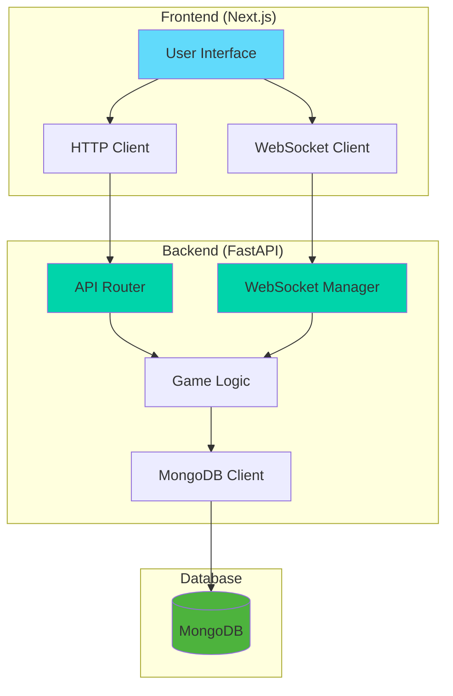
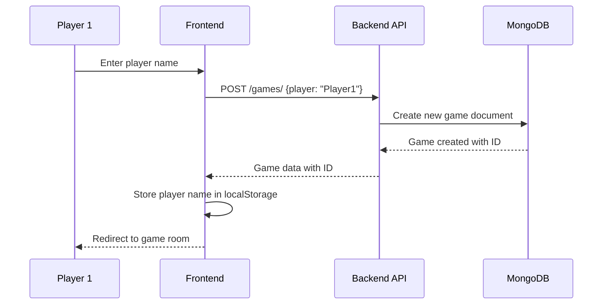
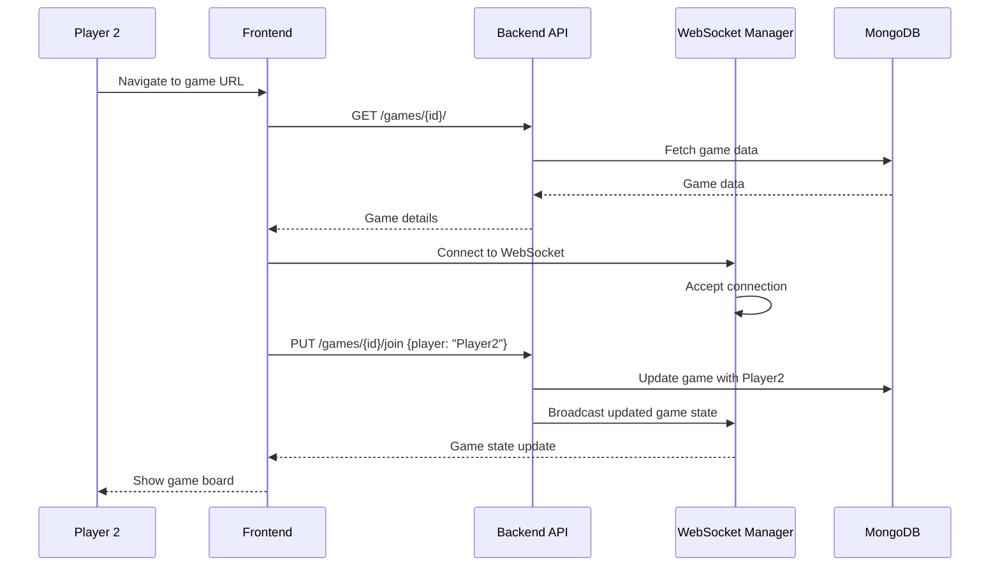
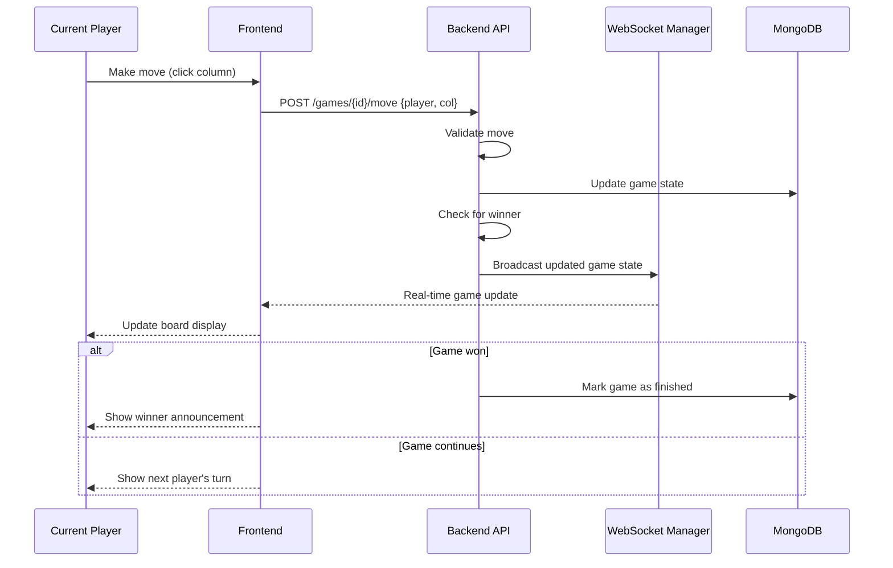

# Connect4 Game

A real-time multiplayer Connect-4 game built with a modern full-stack architecture featuring FastAPI backend and Next.js frontend with WebSocket support.

## 🏗️ Architecture Overview

The application follows a client-server architecture with real-time communication capabilities:



## 🔄 System Components

### Frontend Layer
- **Next.js 15** with React 19
- **TypeScript** for type safety
- **Tailwind CSS** for styling
- **WebSocket client** for real-time updates
- **HTTP client** for REST API calls

### Backend Layer
- **FastAPI** for REST API endpoints
- **WebSocket support** for real-time game updates
- **Pydantic models** for data validation
- **MongoDB integration** for data persistence
- **CORS middleware** for cross-origin requests

### Data Layer
- **MongoDB** for game state storage
- **Pydantic models** for data serialization
- **Connection pooling** for database efficiency

## 🎮 Game Flow Sequence

### 1. Game Creation Flow



### 2. Player Joining Flow



### 3. Game Play Flow



## 📁 Project Structure

```
Connect4/
├── backend/                 # FastAPI backend
│   ├── src/
│   │   ├── api/            # API endpoints and models
│   │   │   ├── models.py   # Pydantic data models
│   │   │   ├── views.py    # REST API endpoints
│   │   │   └── websocket.py # WebSocket management
│   │   ├── connect4/       # Application settings
│   │   ├── db/             # Database utilities
│   │   └── main.py         # FastAPI application entry
│   └── tests/              # Backend tests
├── frontend/                # Next.js frontend
│   ├── src/
│   │   ├── app/            # Next.js app router
│   │   │   ├── games/      # Game-related pages
│   │   │   └── page.tsx    # Home page
│   │   ├── components/     # Reusable UI components
│   │   └── utils/          # Utility functions
│   └── package.json        # Frontend dependencies
└── README.md               # This file
```

## 🚀 Getting Started

### Prerequisites
- Python 3.8+
- Node.js 18+
- MongoDB instance

### Backend Setup
```bash
cd backend
pip install -r requirements.txt
python -m uvicorn src.main:app --reload
```

### Frontend Setup
```bash
cd frontend
npm install
npm run dev
```

### Environment Variables
Create `.env` files in both backend and frontend directories:

**Backend (.env)**
```env
MONGO_DB_URI=mongodb://localhost:27017
MONGO_DB_DB=connect4
```

**Frontend (.env.local)**
```env
NEXT_PUBLIC_BACKEND_API_BASE_URL=http://localhost:8000
NEXT_PUBLIC_BACKEND_WS_BASE_URL=ws://localhost:8000
```

## 🔧 API Endpoints

### REST API
- `POST /games/` - Create new game
- `GET /games/{id}/` - Get game details
- `PUT /games/{id}/join` - Join existing game
- `POST /games/{id}/move` - Make a move

### WebSocket
- `ws://localhost:8000/games/ws/{game_id}/` - Real-time game updates

## 🎯 Key Features

- **Real-time multiplayer** gameplay via WebSocket
- **Responsive design** with Tailwind CSS
- **Type-safe** development with TypeScript and Pydantic
- **MongoDB persistence** for game state
- **CORS support** for development flexibility
- **Modern React patterns** with Next.js 15

## 🧪 Testing

```bash
# Backend tests
cd backend
python -m pytest

# Frontend tests
cd frontend
npm run test
```

## 📝 License

This project is licensed under the MIT License - see the [LICENSE](LICENSE) file for details.

## 🤝 Contributing

1. Fork the repository
2. Create a feature branch
3. Make your changes
4. Add tests if applicable
5. Submit a pull request

## 🔍 Architecture Benefits

- **Scalability**: Microservices-ready architecture
- **Maintainability**: Clear separation of concerns
- **Performance**: Real-time updates with WebSocket
- **Reliability**: MongoDB for persistent storage
- **Developer Experience**: Type safety and modern tooling
